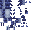

# Armorsaurus Gauntlet

<small>[Tensura: Reincarnated](../../index.md) &rsaquo; [Items](../index.md) &rsaquo; [Weapons](index.md)</small>

| | |
|---|---|
| **ID** | `tensura:armorsaurus_gauntlet` |
| **Category** | Weapons |
| **Durability** | 100 |
| **Gear EP** | 4,800 - None |
| **Attack damage** | 8 |
| **Attack speed** | 1.2 |
| **Sweep damage** | -100% |
| **Tier** | High Magisteel |

## What it does

A multitool gauntlet: it mines the blocks in Tensura's multitool tag, digs monster-diggable blocks very fast and cuts cobwebs. It adds **+2** attack knockback but no sweep. Hold right-click to raise it like a guard. The [Body Armor](../../abilities/intrinsic-skills/body-armor.md) skill uses it for its armored fist.

A High Magisteel weapon that deals **8** attack damage at **1.2** attack speed. It also has no sweeping attack and +2 knockback. Durability: **2,500**.

## Tags

`tensura:body_armor_items`, `tensura:empty_hand_pose`, `tensura:fist_weapons`, `tensura:multitools`, `tensura:shields`
