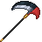

# Blade Tiger Scythe

<small>[Tensura: Reincarnated](../../index.md) &rsaquo; [Items](../index.md) &rsaquo; [Weapons](index.md)</small>

| | |
|---|---|
| **ID** | `tensura:blade_tiger_scythe` |
| **Category** | Weapons |
| **Durability** | 2,000 |
| **Gear EP** | 18,000 - None |

## What it does

It is made at the Smithing Bench.

## Obtaining

### Recipes

**Smithing Bench** &rarr;  [Blade Tiger Scythe](blade-tiger-scythe.md)

Ingredients:  [Blade Tiger Tail](../miscellaneous/blade-tiger-tail.md),  [Gold Ingot](https://minecraft.wiki/w/Gold_Ingot),  [Stick](https://minecraft.wiki/w/Stick) x3

Requires schematic:  [Gold Gear Schematic](../schematics/gold-gear-schematic.md),  [Great Sword Schematic](../schematics/great-sword-schematic.md),  [Spear Schematic](../schematics/spear-schematic.md)

## Tags

`tensura:scythes`
