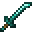

# Diamond Katana

<small>[Tensura: Reincarnated](../../index.md) &rsaquo; [Items](../index.md) &rsaquo; [Weapons](index.md)</small>

| | |
|---|---|
| **ID** | `tensura:diamond_katana` |
| **Category** | Weapons |

## Obtaining

### Recipes

**Smithing Bench** &rarr;  [Diamond Katana](diamond-katana.md)

Ingredients:  [Diamond](https://minecraft.wiki/w/Diamond) x2,  [Stick](https://minecraft.wiki/w/Stick)

Requires schematic:  [Diamond Gear Schematic](../schematics/diamond-gear-schematic.md),  [Japanese Sword Schematic](../schematics/japanese-sword-schematic.md)

## Used in

[Netherite Katana](netherite-katana.md)

## Tags

`tensura:katanas`
