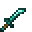

# Diamond Kodachi

<small>[Tensura: Reincarnated](../../index.md) &rsaquo; [Items](../index.md) &rsaquo; [Weapons](index.md)</small>

| | |
|---|---|
| **ID** | `tensura:diamond_kodachi` |
| **Category** | Weapons |
| **Attack damage** | 5 |
| **Attack speed** | 2 |
| **Tier** | Diamond |
| **Durability** | 1,561 |

## What it does

A kodachi that deals **5** attack damage at **2** attack speed. It also has -0.75 blocks of reach, +20% critical hit chance, +0.5 critical damage multiplier and no sweeping attack. Durability: **1,561**. It is made at the Smithing Bench.

## Obtaining

### Recipes

**Smithing Bench** &rarr;  [Diamond Kodachi](diamond-kodachi.md)

Ingredients:  [Diamond](https://minecraft.wiki/w/Diamond),  [Stick](https://minecraft.wiki/w/Stick)

Requires schematic:  [Diamond Gear Schematic](../schematics/diamond-gear-schematic.md),  [Short Sword Schematic](../schematics/short-sword-schematic.md),  [Japanese Sword Schematic](../schematics/japanese-sword-schematic.md)

## Used in

[Netherite Kodachi](netherite-kodachi.md)

## Tags

`tensura:kodachis`
