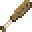

# Goblin Club

<small>[Tensura: Reincarnated](../../index.md) &rsaquo; [Items](../index.md) &rsaquo; [Weapons](index.md)</small>

| | |
|---|---|
| **ID** | `tensura:goblin_club` |
| **Category** | Weapons |
| **Rarity** | Rare |
| **Attack damage** | 3 |
| **Attack speed** | 1.5 |
| **Tier** | Wood |
| **Durability** | 59 |

## What it does

A Wood sword that deals **3** attack damage at **1.5** attack speed. It also has +0.5 critical damage multiplier and +0.5 knockback. Durability: **59**.

## Used in

[Kanabo](kanabo.md)

## Tags

`minecraft:enchantable/durability`, `minecraft:enchantable/fire_aspect`, `minecraft:enchantable/mace`
