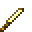

# Golden Short Sword

<small>[Tensura: Reincarnated](../../index.md) &rsaquo; [Items](../index.md) &rsaquo; [Weapons](index.md)</small>

| | |
|---|---|
| **ID** | `tensura:golden_short_sword` |
| **Category** | Weapons |
| **Attack damage** | 2 |
| **Attack speed** | 2 |
| **Tier** | Gold |
| **Durability** | 32 |

## What it does

A short sword that deals **2** attack damage at **2** attack speed. It also has -0.75 blocks of reach, +0.5 critical damage multiplier and no sweeping attack. Durability: **32**. It is made at the Smithing Bench.

## Obtaining

### Recipes

**Smithing Bench** &rarr;  [Golden Short Sword](golden-short-sword.md)

Ingredients:  [Gold Ingot](https://minecraft.wiki/w/Gold_Ingot),  [Stick](https://minecraft.wiki/w/Stick)

Requires schematic:  [Gold Gear Schematic](../schematics/gold-gear-schematic.md),  [Short Sword Schematic](../schematics/short-sword-schematic.md)

## Tags

`minecraft:piglin_loved`, `tensura:short_swords`
