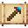

# High Magic Staff

<small>[Tensura: Reincarnated](../../index.md) &rsaquo; [Items](../index.md) &rsaquo; [Weapons](index.md)</small>

| | |
|---|---|
| **ID** | `tensura:high_magic_staff` |
| **Category** | Weapons |
| **Durability** | 500 |
| **Rarity** | Rare |
| **Gear EP** | 52,000 - None |
| **Attack damage** | 17 |
| **Attack speed** | 1 |
| **Tier** | Pure Magisteel |

## What it does

A Pure Magisteel weapon that deals **17** attack damage at **1** attack speed. It also has +0.5 blocks of reach. Durability: **3,000**. It is made at the Smithing Bench.

## Obtaining

### Recipes

**Smithing Bench** &rarr;  [High Magic Staff](high-magic-staff.md)

Ingredients:  [Magic Stone](../materials/magic-stone.md),  [Pure Magisteel Ingot](../materials/pure-magisteel-ingot.md) x2,  [Stick](https://minecraft.wiki/w/Stick) x3

Requires schematic:  [Pure Magisteel Gear Schematic](../schematics/pure-magisteel-gear-schematic.md),  [Magic Staff Schematic](../schematics/magic-staff-schematic.md)

## Tags

`tensura:magic_staves`, `tensura:spell_cast_weapons`
