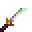

# High Magisteel Kodachi

<small>[Tensura: Reincarnated](../../index.md) &rsaquo; [Items](../index.md) &rsaquo; [Weapons](index.md)</small>

| | |
|---|---|
| **ID** | `tensura:high_magisteel_kodachi` |
| **Category** | Weapons |
| **Fire resistant** | Yes |
| **Gear EP** | 18,000 - 52,000 |
| **Evolves into** | [Pure Magisteel Kodachi](pure-magisteel-kodachi.md) |
| **Attack damage** | 18 |
| **Attack speed** | 2 |
| **Reach** | -0.75 blocks |
| **Sweep damage** | -100% |
| **Critical chance** | +20% |
| **Critical damage** | +0.5× |
| **Tier** | High Magisteel |
| **Durability** | 2,500 |

## What it does

A kodachi that deals **18** attack damage at **2** attack speed. It also has -0.75 blocks of reach, +20% critical hit chance, +0.5 critical damage multiplier and no sweeping attack. Durability: **2,500**. It is made at the Smithing Bench.

## Obtaining

### Recipes

**Smithing Bench** &rarr;  [High Magisteel Kodachi](high-magisteel-kodachi.md)

Ingredients:  [High Magisteel Ingot](../materials/high-magisteel-ingot.md),  [Gold Ingot](https://minecraft.wiki/w/Gold_Ingot),  [Stick](https://minecraft.wiki/w/Stick)

Requires schematic:  [High Magisteel Gear Schematic](../schematics/high-magisteel-gear-schematic.md),  [Short Sword Schematic](../schematics/short-sword-schematic.md),  [Japanese Sword Schematic](../schematics/japanese-sword-schematic.md)

## Tags

`tensura:kodachis`
