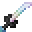

# Hihi'Irokane Katana

<small>[Tensura: Reincarnated](../../index.md) &rsaquo; [Items](../index.md) &rsaquo; [Weapons](index.md)</small>

| | |
|---|---|
| **ID** | `tensura:hihiirokane_katana` |
| **Category** | Weapons |
| **Fire resistant** | Yes |
| **Gear EP** | 750,000 - None |
| **Attack damage** | 81 (80 one-handed) |
| **Attack speed** | 1.8 (1.6 one-handed) |
| **Tier** | Hihiirokane |
| **Durability** | 3,600 |

## What it does

A katana you can hold in one or both hands. Two-handed it deals **81** attack damage at **1.8** attack speed; one-handed **80** damage at **1.6** speed. It also has +20% critical hit chance and 25% sweeping damage. Durability: **3,600**. It is made at the Smithing Bench.

## Obtaining

### Recipes

**Smithing Bench** &rarr;  [Hihi'Irokane Katana](hihiirokane-katana.md)

Ingredients:  [Hihi'Irokane Ingot](../materials/hihiirokane-ingot.md) x2,  [Stick](https://minecraft.wiki/w/Stick)

Requires schematic:  [Hihi'Irokane Gear Schematic](../schematics/hihiirokane-gear-schematic.md),  [Japanese Sword Schematic](../schematics/japanese-sword-schematic.md)

## Tags

`tensura:hihiirokane_items`, `tensura:katanas`
