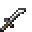
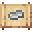

# Iron Kodachi

<small>[Tensura: Reincarnated](../../index.md) &rsaquo; [Items](../index.md) &rsaquo; [Weapons](index.md)</small>

| | |
|---|---|
| **ID** | `tensura:iron_kodachi` |
| **Category** | Weapons |

## Obtaining

### Recipes

**Smithing Bench** &rarr;  [Iron Kodachi](iron-kodachi.md)

Ingredients:  [Iron Ingot](https://minecraft.wiki/w/Iron_Ingot),  [Stick](https://minecraft.wiki/w/Stick)

Requires schematic:  [Iron Gear Schematic](../schematics/iron-gear-schematic.md),  [Short Sword Schematic](../schematics/short-sword-schematic.md),  [Japanese Sword Schematic](../schematics/japanese-sword-schematic.md)

## Tags

`tensura:kodachis`
