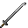

# Iron Tachi

<small>[Tensura: Reincarnated](../../index.md) &rsaquo; [Items](../index.md) &rsaquo; [Weapons](index.md)</small>

| | |
|---|---|
| **ID** | `tensura:iron_tachi` |
| **Category** | Weapons |
| **Attack damage** | 8 (7 one-handed) |
| **Attack speed** | 1.4 (1.2 one-handed) |
| **Tier** | Iron |
| **Durability** | 250 |

## What it does

A tachi you can hold in one or both hands. Two-handed it deals **8** attack damage at **1.4** attack speed; one-handed **7** damage at **1.2** speed. It also has +1 block of reach, +20% critical hit chance and 25% sweeping damage. Durability: **250**. It is made at the Smithing Bench.

## Obtaining

### Recipes

**Smithing Bench** &rarr;  [Iron Tachi](iron-tachi.md)

Ingredients:  [Iron Ingot](https://minecraft.wiki/w/Iron_Ingot) x3,  [Stick](https://minecraft.wiki/w/Stick)

Requires schematic:  [Iron Gear Schematic](../schematics/iron-gear-schematic.md),  [Long Sword Schematic](../schematics/long-sword-schematic.md),  [Japanese Sword Schematic](../schematics/japanese-sword-schematic.md)

## Tags

`tensura:tachis`
