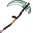

# Low Magisteel Scythe

<small>[Tensura: Reincarnated](../../index.md) &rsaquo; [Items](../index.md) &rsaquo; [Weapons](index.md)</small>

| | |
|---|---|
| **ID** | `tensura:low_magisteel_scythe` |
| **Category** | Weapons |
| **Gear EP** | 6,000 - 18,000 |
| **Evolves into** | [High Magisteel Scythe](high-magisteel-scythe.md) |

## Obtaining

### Recipes

**Smithing Bench** &rarr;  [Low Magisteel Scythe](low-magisteel-scythe.md)

Ingredients:  [Low Magisteel Ingot](../materials/low-magisteel-ingot.md) x4,  [Gold Ingot](https://minecraft.wiki/w/Gold_Ingot),  [Stick](https://minecraft.wiki/w/Stick) x3

Requires schematic:  [Low Magisteel Gear Schematic](../schematics/low-magisteel-gear-schematic.md),  [Great Sword Schematic](../schematics/great-sword-schematic.md),  [Spear Schematic](../schematics/spear-schematic.md)

## Tags

`tensura:scythes`
