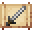

# Mithril Great Sword

<small>[Tensura: Reincarnated](../../index.md) &rsaquo; [Items](../index.md) &rsaquo; [Weapons](index.md)</small>

| | |
|---|---|
| **ID** | `tensura:mithril_great_sword` |
| **Category** | Weapons |
| **Fire resistant** | Yes |
| **Gear EP** | 45,000 - 225,000 |
| **Evolves into** | [Adamantite Great Sword](adamantite-great-sword.md) |
| **Attack damage** | 29 (0 one-handed) |
| **Attack speed** | 0.8 (0 one-handed) |
| **Reach** | +2 blocks |
| **Sweep damage** | +50% |
| **Tier** | Mithril |
| **Durability** | 2,700 |

## What it does

A great sword you can hold in one or both hands. Two-handed it deals **29** attack damage at **0.8** attack speed; one-handed **0** damage at **0** speed. It also has +2 blocks of reach and 50% sweeping damage. Durability: **2,700**. It is made at the Smithing Bench.

## Obtaining

### Recipes

**Smithing Bench** &rarr;  [Mithril Great Sword](mithril-great-sword.md)

Ingredients:  [Mithril Ingot](../materials/mithril-ingot.md) x4,  [Gold Ingot](https://minecraft.wiki/w/Gold_Ingot),  [Stick](https://minecraft.wiki/w/Stick)

Requires schematic:  [Mithril Gear Schematic](../schematics/mithril-gear-schematic.md),  [Great Sword Schematic](../schematics/great-sword-schematic.md)

## Tags

`tensura:great_swords`
