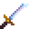

# Mithril Katana

<small>[Tensura: Reincarnated](../../index.md) &rsaquo; [Items](../index.md) &rsaquo; [Weapons](index.md)</small>

| | |
|---|---|
| **ID** | `tensura:mithril_katana` |
| **Category** | Weapons |
| **Fire resistant** | Yes |
| **Gear EP** | 45,000 - 225,000 |
| **Evolves into** | [Adamantite Katana](adamantite-katana.md) |
| **Attack damage** | 27 (26 one-handed) |
| **Attack speed** | 1.8 (1.6 one-handed) |
| **Tier** | Mithril |
| **Durability** | 2,700 |

## What it does

A katana you can hold in one or both hands. Two-handed it deals **27** attack damage at **1.8** attack speed; one-handed **26** damage at **1.6** speed. It also has +20% critical hit chance and 25% sweeping damage. Durability: **2,700**. It is made at the Smithing Bench.

## Obtaining

### Recipes

**Smithing Bench** &rarr;  [Mithril Katana](mithril-katana.md)

Ingredients:  [Mithril Ingot](../materials/mithril-ingot.md) x2,  [Gold Ingot](https://minecraft.wiki/w/Gold_Ingot),  [Stick](https://minecraft.wiki/w/Stick)

Requires schematic:  [Mithril Gear Schematic](../schematics/mithril-gear-schematic.md),  [Japanese Sword Schematic](../schematics/japanese-sword-schematic.md)

## Tags

`tensura:katanas`
