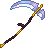

# Mithril Scythe

<small>[Tensura: Reincarnated](../../index.md) &rsaquo; [Items](../index.md) &rsaquo; [Weapons](index.md)</small>

| | |
|---|---|
| **ID** | `tensura:mithril_scythe` |
| **Category** | Weapons |
| **Gear EP** | 45,000 - 225,000 |
| **Evolves into** | [Adamantite Scythe](adamantite-scythe.md) |

## Obtaining

### Recipes

**Smithing Bench** &rarr;  [Mithril Scythe](mithril-scythe.md)

Ingredients:  [Mithril Ingot](../materials/mithril-ingot.md) x4,  [Gold Ingot](https://minecraft.wiki/w/Gold_Ingot),  [Stick](https://minecraft.wiki/w/Stick) x3

Requires schematic:  [Mithril Gear Schematic](../schematics/mithril-gear-schematic.md),  [Great Sword Schematic](../schematics/great-sword-schematic.md),  [Spear Schematic](../schematics/spear-schematic.md)

## Tags

`tensura:scythes`
