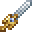

# Moonlight

<small>[Tensura: Reincarnated](../../index.md) &rsaquo; [Items](../index.md) &rsaquo; [Weapons](index.md)</small>

| | |
|---|---|
| **ID** | `tensura:moonlight` |
| **Category** | Weapons |
| **Fire resistant** | Yes |
| **Gear EP** | 60,000 - None |
| **Attack damage** | 42 |
| **Attack speed** | 1.8 |
| **Reach** | +1 blocks |
| **Sweep damage** | +25% |
| **Critical chance** | +50% |
| **Tier** | Mithril |
| **Durability** | 2,700 |

## What it does

A Mithril sword that deals **42** attack damage at **1.8** attack speed. It also has +1 block of reach, +50% critical hit chance and 25% sweeping damage. Durability: **2,700**.

## Tags

`minecraft:indestructible_by_environmental_cause`, `tensura:long_swords`
