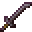

# Netherite Katana

<small>[Tensura: Reincarnated](../../index.md) &rsaquo; [Items](../index.md) &rsaquo; [Weapons](index.md)</small>

| | |
|---|---|
| **ID** | `tensura:netherite_katana` |
| **Category** | Weapons |
| **Fire resistant** | Yes |
| **Attack damage** | 9 (8 one-handed) |
| **Attack speed** | 1.8 (1.6 one-handed) |
| **Sweep damage** | +25% |
| **Critical chance** | +20% |
| **Tier** | Netherite |
| **Durability** | 2,031 |

## What it does

A katana you can hold in one or both hands. Two-handed it deals **9** attack damage at **1.8** attack speed; one-handed **8** damage at **1.6** speed. It also has +20% critical hit chance and 25% sweeping damage. Durability: **2,031**. It is made at a smithing table.

## Obtaining

### Recipes

**Smithing Table** &rarr;  [Netherite Katana](netherite-katana.md)

Ingredients:  [Netherite Upgrade Smithing Template](https://minecraft.wiki/w/Netherite_Upgrade_Smithing_Template),  [Diamond Katana](diamond-katana.md),  [Netherite Ingot](https://minecraft.wiki/w/Netherite_Ingot)

## Tags

`tensura:katanas`
