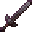

# Netherite Long Sword

<small>[Tensura: Reincarnated](../../index.md) &rsaquo; [Items](../index.md) &rsaquo; [Weapons](index.md)</small>

| | |
|---|---|
| **ID** | `tensura:netherite_long_sword` |
| **Category** | Weapons |
| **Fire resistant** | Yes |

## Obtaining

### Recipes

**Smithing Table** &rarr;  [Netherite Long Sword](netherite-long-sword.md)

Ingredients:  [Netherite Upgrade Smithing Template](https://minecraft.wiki/w/Netherite_Upgrade_Smithing_Template),  [Diamond Long Sword](diamond-long-sword.md),  [Netherite Ingot](https://minecraft.wiki/w/Netherite_Ingot)

## Tags

`tensura:long_swords`
