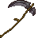
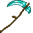

# Netherite Scythe

<small>[Tensura: Reincarnated](../../index.md) &rsaquo; [Items](../index.md) &rsaquo; [Weapons](index.md)</small>

| | |
|---|---|
| **ID** | `tensura:netherite_scythe` |
| **Category** | Weapons |
| **Attack damage** | 10 (9 one-handed) |
| **Attack speed** | 0.8 (0.6 one-handed) |
| **Reach** | +2 blocks |
| **Sweep damage** | +75% (+50% one-handed) |
| **Critical chance** | +50% |
| **Tier** | Netherite |
| **Durability** | 2,031 |

## What it does

A scythe you can hold in one or both hands. Two-handed it deals **10** attack damage at **0.8** attack speed; one-handed **9** damage at **0.6** speed. It also has +2 blocks of reach, +50% critical hit chance and 75% sweeping damage. Durability: **2,031**. It is made at a smithing table.

## Obtaining

### Recipes

**Smithing Table** &rarr;  [Netherite Scythe](netherite-scythe.md)

Ingredients:  [Netherite Upgrade Smithing Template](https://minecraft.wiki/w/Netherite_Upgrade_Smithing_Template),  [Diamond Scythe](diamond-scythe.md),  [Netherite Ingot](https://minecraft.wiki/w/Netherite_Ingot)

## Tags

`tensura:scythes`
