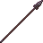

# Netherite Spear

<small>[Tensura: Reincarnated](../../index.md) &rsaquo; [Items](../index.md) &rsaquo; [Weapons](index.md)</small>

| | |
|---|---|
| **ID** | `tensura:netherite_spear` |
| **Category** | Weapons |
| **Fire resistant** | Yes |
| **Attack damage** | 8 (7 one-handed) |
| **Attack speed** | 1.4 (1 one-handed) |
| **Tier** | Netherite |
| **Durability** | 2,031 |

## What it does

A spear you can hold in one or both hands. Two-handed it deals **8** attack damage at **1.4** attack speed; one-handed **7** damage at **1** speed. It also has +2 blocks of reach and no sweeping attack. Durability: **2,031**. It is made at a smithing table.

## Obtaining

### Recipes

**Smithing Table** &rarr;  [Netherite Spear](netherite-spear.md)

Ingredients:  [Netherite Upgrade Smithing Template](https://minecraft.wiki/w/Netherite_Upgrade_Smithing_Template),  [Diamond Spear](diamond-spear.md),  [Netherite Ingot](https://minecraft.wiki/w/Netherite_Ingot)

## Tags

`mysticism:projectile`, `tensura:spears`
