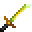

# Orichalcum Katana

<small>[Tensura: Reincarnated](../../index.md) &rsaquo; [Items](../index.md) &rsaquo; [Weapons](index.md)</small>

| | |
|---|---|
| **ID** | `tensura:orichalcum_katana` |
| **Category** | Weapons |
| **Fire resistant** | Yes |
| **Gear EP** | 50,000 - 750,000 |
| **Evolves into** | [Hihi'Irokane Katana](hihiirokane-katana.md) |

## Obtaining

### Recipes

**Smithing Bench** &rarr;  [Orichalcum Katana](orichalcum-katana.md)

Ingredients:  [Orichalcum Ingot](../materials/orichalcum-ingot.md) x2,  [Stick](https://minecraft.wiki/w/Stick)

Requires schematic:  [Orichalcum Gear Schematic](../schematics/orichalcum-gear-schematic.md),  [Japanese Sword Schematic](../schematics/japanese-sword-schematic.md)

## Tags

`minecraft:piglin_loved`, `tensura:katanas`
