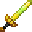

# Orichalcum Long Sword

<small>[Tensura: Reincarnated](../../index.md) &rsaquo; [Items](../index.md) &rsaquo; [Weapons](index.md)</small>

| | |
|---|---|
| **ID** | `tensura:orichalcum_long_sword` |
| **Category** | Weapons |
| **Fire resistant** | Yes |
| **Gear EP** | 50,000 - 750,000 |
| **Evolves into** | [Hihi'Irokane Long Sword](hihiirokane-long-sword.md) |
| **Attack damage** | 32 (31 one-handed) |
| **Attack speed** | 1.4 (1.2 one-handed) |
| **Reach** | +1 blocks |
| **Sweep damage** | +25% |
| **Tier** | Orichalcum |
| **Durability** | 2,800 |

## What it does

A long sword you can hold in one or both hands. Two-handed it deals **32** attack damage at **1.4** attack speed; one-handed **31** damage at **1.2** speed. It also has +1 block of reach and 25% sweeping damage. Durability: **2,800**. It is made at the Smithing Bench.

## Obtaining

### Recipes

**Smithing Bench** &rarr;  [Orichalcum Long Sword](orichalcum-long-sword.md)

Ingredients:  [Orichalcum Ingot](../materials/orichalcum-ingot.md) x3,  [Stick](https://minecraft.wiki/w/Stick)

Requires schematic:  [Orichalcum Gear Schematic](../schematics/orichalcum-gear-schematic.md),  [Long Sword Schematic](../schematics/long-sword-schematic.md)

## Tags

`minecraft:piglin_loved`, `tensura:long_swords`
