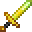

# Orichalcum Sword

<small>[Tensura: Reincarnated](../../index.md) &rsaquo; [Items](../index.md) &rsaquo; [Weapons](index.md)</small>

| | |
|---|---|
| **ID** | `tensura:orichalcum_sword` |
| **Category** | Weapons |
| **Gear EP** | 50,000 - 750,000 |
| **Evolves into** | [Hihi'Irokane Sword](hihiirokane-sword.md) |
| **Attack damage** | 30 |
| **Attack speed** | 1.6 |
| **Tier** | Orichalcum |
| **Durability** | 2,800 |

## What it does

A sword that deals **30** attack damage at **1.6** attack speed. Durability: **2,800**. It is made at the Smithing Bench.

## Obtaining

### Recipes

**Smithing Bench** &rarr;  [Orichalcum Sword](orichalcum-sword.md)

Ingredients:  [Orichalcum Ingot](../materials/orichalcum-ingot.md) x2,  [Stick](https://minecraft.wiki/w/Stick)

Requires schematic:  [Orichalcum Gear Schematic](../schematics/orichalcum-gear-schematic.md)

## Tags

`minecraft:piglin_loved`, `minecraft:swords`
