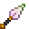

# Pure Magisteel Kunai

<small>[Tensura: Reincarnated](../../index.md) &rsaquo; [Items](../index.md) &rsaquo; [Weapons](index.md)</small>

| | |
|---|---|
| **ID** | `tensura:pure_magisteel_kunai` |
| **Category** | Weapons |
| **Fire resistant** | Yes |
| **Gear EP** | 52,000 - None |
| **Attack damage** | 10 |
| **Attack speed** | 1.7 |
| **Reach** | -1 blocks |
| **Sweep damage** | -100% |
| **Critical damage** | +0.5× |
| **Tier** | Low Magisteel |
| **Durability** | 1,800 |

## What it does

A Low Magisteel kunai that deals **10** attack damage at **1.7** attack speed. It also has -1 block of reach, +0.5 critical damage multiplier and no sweeping attack. Durability: **1,800**. It is made at the Smithing Bench.

## Obtaining

### Recipes

**Smithing Bench** &rarr;  [Pure Magisteel Kunai](pure-magisteel-kunai.md)

Ingredients:  [Pure Magisteel Nugget](../materials/pure-magisteel-nugget.md) x5,  [Gold Nugget](https://minecraft.wiki/w/Gold_Nugget) x2

Requires schematic:  [Kunai Schematic](../schematics/kunai-schematic.md),  [Pure Magisteel Gear Schematic](../schematics/pure-magisteel-gear-schematic.md)

## Tags

`minecraft:enchantable/bow`, `minecraft:enchantable/crossbow`, `minecraft:enchantable/durability`, `minecraft:enchantable/sharp_weapon`, `minecraft:enchantable/trident`, `mysticism:projectile`, `tensura:ranged_enchantable`, `tensura:slotting_cast_excluded`
