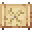

# Severer Blade

<small>[Tensura: Reincarnated](../../index.md) &rsaquo; [Items](../index.md) &rsaquo; [Weapons](index.md)</small>

| | |
|---|---|
| **ID** | `tensura:severer_blade` |
| **Category** | Weapons |
| **Stack size** | 64 |

## Obtaining

### Recipes

**Smithing Bench** &rarr;  [Severer Blade](severer-blade.md) x3

Ingredients:  [Iron Ingot](https://minecraft.wiki/w/Iron_Ingot) x2,  [Ender Pearl](https://minecraft.wiki/w/Ender_Pearl)

Requires schematic:  [Spatial Blade Schematic](../schematics/spatial-blade-schematic.md)

## Used in

[Spatial Blade](spatial-blade.md)

## Tags

`mysticism:projectile`
