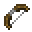
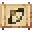

# Short Bow

<small>[Tensura: Reincarnated](../../index.md) &rsaquo; [Items](../index.md) &rsaquo; [Weapons](index.md)</small>

| | |
|---|---|
| **ID** | `tensura:short_bow` |
| **Category** | Weapons |
| **Durability** | 231 |

## What it does

It is made at the Smithing Bench and found in 2 kinds of loot chest.

## Obtaining

### Recipes

**Smithing Bench** &rarr;  [Short Bow](short-bow.md)

Ingredients:  [Stick](https://minecraft.wiki/w/Stick) x2,  [String](https://minecraft.wiki/w/String) x2

Requires schematic:  [Basic Bows Schematic](../schematics/basic-bows-schematic.md)

### Loot

| Source | Count | Chance | Notes |
|---|---|---|---|
| Chest: Goblin Tower (`tensura:chests/goblin_tower`) | 1 | 53% |  |
| Chest: Lizardman Tower (`tensura:chests/lizardman_tower`) | 1 | 46% |  |

## Tags

`c:tools/bow`, `minecraft:enchantable/bow`, `minecraft:enchantable/durability`, `tensura:no_slowness_on_use`
