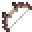

# Short Spider Bow

<small>[Tensura: Reincarnated](../../index.md) &rsaquo; [Items](../index.md) &rsaquo; [Weapons](index.md)</small>

| | |
|---|---|
| **ID** | `tensura:short_spider_bow` |
| **Category** | Weapons |
| **Durability** | 578 |
| **Gear EP** | 9,000 - None |

## Obtaining

### Recipes

**Smithing Bench** &rarr;  [Short Spider Bow](short-spider-bow.md)

Ingredients:  [Knight Spider Leg](../miscellaneous/knight-spider-leg.md) x2,  `#tensura:strong_thread` x2

Requires schematic:  [Spider Bows Schematic](../schematics/spider-bows-schematic.md)

### Loot

| Source | Count | Chance | Notes |
|---|---|---|---|
| Chest: Spider Nest (`tensura:chests/spider_nest`) | 1 | 5.1% |  |

## Tags

`c:tools/bow`, `minecraft:enchantable/bow`, `minecraft:enchantable/durability`, `tensura:no_slowness_on_use`
