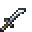

# Silver Kodachi

<small>[Tensura: Reincarnated](../../index.md) &rsaquo; [Items](../index.md) &rsaquo; [Weapons](index.md)</small>

| | |
|---|---|
| **ID** | `tensura:silver_kodachi` |
| **Category** | Weapons |
| **Gear EP** | 0 - 0 |
| **Attack damage** | 4 |
| **Attack speed** | 2 |
| **Tier** | Silver |
| **Durability** | 150 |

## What it does

A kodachi that deals **4** attack damage at **2** attack speed. It also has -0.75 blocks of reach, +20% critical hit chance, +0.5 critical damage multiplier and no sweeping attack. Durability: **150**. It is made at the Smithing Bench.

## Obtaining

### Recipes

**Smithing Bench** &rarr;  [Silver Kodachi](silver-kodachi.md)

Ingredients:  [Silver Ingot](../materials/silver-ingot.md),  [Stick](https://minecraft.wiki/w/Stick)

Requires schematic:  [Silver Gear Schematic](../schematics/silver-gear-schematic.md),  [Short Sword Schematic](../schematics/short-sword-schematic.md),  [Japanese Sword Schematic](../schematics/japanese-sword-schematic.md)

## Tags

`tensura:kodachis`
