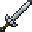

# Silver Long Sword

<small>[Tensura: Reincarnated](../../index.md) &rsaquo; [Items](../index.md) &rsaquo; [Weapons](index.md)</small>

| | |
|---|---|
| **ID** | `tensura:silver_long_sword` |
| **Category** | Weapons |
| **Gear EP** | 0 - 0 |

## Obtaining

### Recipes

**Smithing Bench** &rarr;  [Silver Long Sword](silver-long-sword.md)

Ingredients:  [Silver Ingot](../materials/silver-ingot.md) x3,  [Stick](https://minecraft.wiki/w/Stick)

Requires schematic:  [Silver Gear Schematic](../schematics/silver-gear-schematic.md),  [Long Sword Schematic](../schematics/long-sword-schematic.md)

## Tags

`tensura:long_swords`
