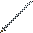

# Silver Odachi

<small>[Tensura: Reincarnated](../../index.md) &rsaquo; [Items](../index.md) &rsaquo; [Weapons](index.md)</small>

| | |
|---|---|
| **ID** | `tensura:silver_odachi` |
| **Category** | Weapons |
| **Gear EP** | 0 - 0 |
| **Attack damage** | 9 (0 one-handed) |
| **Attack speed** | 0.8 (0 one-handed) |
| **Reach** | +2 blocks |
| **Sweep damage** | +50% |
| **Critical chance** | +20% |
| **Tier** | Silver |
| **Durability** | 150 |

## What it does

A odachi you can hold in one or both hands. Two-handed it deals **9** attack damage at **0.8** attack speed; one-handed **0** damage at **0** speed. It also has +2 blocks of reach, +20% critical hit chance and 50% sweeping damage. Durability: **150**. It is made at the Smithing Bench.

## Obtaining

### Recipes

**Smithing Bench** &rarr;  [Silver Odachi](silver-odachi.md)

Ingredients:  [Silver Ingot](../materials/silver-ingot.md) x4,  [Stick](https://minecraft.wiki/w/Stick)

Requires schematic:  [Silver Gear Schematic](../schematics/silver-gear-schematic.md),  [Great Sword Schematic](../schematics/great-sword-schematic.md),  [Japanese Sword Schematic](../schematics/japanese-sword-schematic.md)

## Tags

`tensura:odachis`
