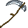

# Silver Scythe

<small>[Tensura: Reincarnated](../../index.md) &rsaquo; [Items](../index.md) &rsaquo; [Weapons](index.md)</small>

| | |
|---|---|
| **ID** | `tensura:silver_scythe` |
| **Category** | Weapons |
| **Gear EP** | 0 - 0 |

## Obtaining

### Recipes

**Smithing Bench** &rarr;  [Silver Scythe](silver-scythe.md)

Ingredients:  [Silver Ingot](../materials/silver-ingot.md) x4,  [Stick](https://minecraft.wiki/w/Stick) x3

Requires schematic:  [Silver Gear Schematic](../schematics/silver-gear-schematic.md),  [Great Sword Schematic](../schematics/great-sword-schematic.md),  [Spear Schematic](../schematics/spear-schematic.md)

## Tags

`tensura:scythes`
