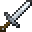

# Silver Sword

<small>[Tensura: Reincarnated](../../index.md) &rsaquo; [Items](../index.md) &rsaquo; [Weapons](index.md)</small>

| | |
|---|---|
| **ID** | `tensura:silver_sword` |
| **Category** | Weapons |
| **Gear EP** | 0 - 0 |

## Obtaining

### Recipes

**Crafting (shaped)** &rarr;  [Silver Sword](silver-sword.md)

| |
|---|
|  [Silver Ingot](../materials/silver-ingot.md) |
|  [Silver Ingot](../materials/silver-ingot.md) |
|  [Stick](https://minecraft.wiki/w/Stick) |

**Smithing Bench** &rarr;  [Silver Sword](silver-sword.md)

Ingredients:  [Silver Ingot](../materials/silver-ingot.md) x2,  [Stick](https://minecraft.wiki/w/Stick)

Requires schematic:  [Silver Gear Schematic](../schematics/silver-gear-schematic.md)

### Loot

| Source | Count | Chance | Notes |
|---|---|---|---|
| Chest: Lizardman Smithy (`tensura:chests/lizardman_smithy`) | 1 | 42% |  |

## Tags

`minecraft:swords`
