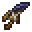

# Spider Dagger

<small>[Tensura: Reincarnated](../../index.md) &rsaquo; [Items](../index.md) &rsaquo; [Weapons](index.md)</small>

| | |
|---|---|
| **ID** | `tensura:spider_dagger` |
| **Category** | Weapons |
| **Durability** | 150 |
| **Gear EP** | 6,000 - None |
| **Attack damage** | 10 |
| **Attack speed** | 2 |
| **Reach** | -1 blocks |
| **Sweep damage** | -100% |
| **Critical chance** | +50% |
| **Tier** | Low Magisteel |

## What it does

A short dagger with a high critical chance. Every hit gives the target [Fatal Poison](../../effects/fatal-poison.md) for 5 seconds. Repair it with Spider Fangs.

A Low Magisteel dagger that deals **10** attack damage at **2** attack speed. It also has -1 block of reach, +50% critical hit chance and no sweeping attack. Durability: **1,800**. It is made at the Smithing Bench.

## Obtaining

### Recipes

**Smithing Bench** &rarr;  [Spider Dagger](spider-dagger.md)

Ingredients:  [Spider Fang](../materials/spider-fang.md),  [Stick](https://minecraft.wiki/w/Stick),  [String](https://minecraft.wiki/w/String)

Requires schematic:  [Dagger Schematic](../schematics/hunting-knife-schematic.md)

## Tags

`tensura:daggers`
