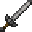

# Stone Long Sword

<small>[Tensura: Reincarnated](../../index.md) &rsaquo; [Items](../index.md) &rsaquo; [Weapons](index.md)</small>

| | |
|---|---|
| **ID** | `tensura:stone_long_sword` |
| **Category** | Weapons |
| **Attack damage** | 7 (6 one-handed) |
| **Attack speed** | 1.4 (1.2 one-handed) |
| **Reach** | +1 blocks |
| **Sweep damage** | +25% |
| **Tier** | Stone |
| **Durability** | 131 |

## What it does

A long sword you can hold in one or both hands. Two-handed it deals **7** attack damage at **1.4** attack speed; one-handed **6** damage at **1.2** speed. It also has +1 block of reach and 25% sweeping damage. Durability: **131**. It is made at the Smithing Bench.

## Obtaining

### Recipes

**Smithing Bench** &rarr;  [Stone Long Sword](stone-long-sword.md)

Ingredients:  `#minecraft:stone_tool_materials` x3,  [Stick](https://minecraft.wiki/w/Stick)

Requires schematic:  [Long Sword Schematic](../schematics/long-sword-schematic.md)

## Tags

`tensura:long_swords`
