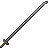

# Stone Odachi

<small>[Tensura: Reincarnated](../../index.md) &rsaquo; [Items](../index.md) &rsaquo; [Weapons](index.md)</small>

| | |
|---|---|
| **ID** | `tensura:stone_odachi` |
| **Category** | Weapons |

## Obtaining

### Recipes

**Smithing Bench** &rarr;  [Stone Odachi](stone-odachi.md)

Ingredients:  `#minecraft:stone_tool_materials` x4,  [Stick](https://minecraft.wiki/w/Stick)

Requires schematic:  [Great Sword Schematic](../schematics/great-sword-schematic.md),  [Japanese Sword Schematic](../schematics/japanese-sword-schematic.md)

## Tags

`tensura:odachis`
