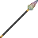
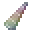
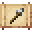

# Unicorn Horn Spear

<small>[Tensura: Reincarnated](../../index.md) &rsaquo; [Items](../index.md) &rsaquo; [Weapons](index.md)</small>

| | |
|---|---|
| **ID** | `tensura:unicorn_horn_spear` |
| **Category** | Weapons |
| **Durability** | 500 |
| **Gear EP** | 18,000 - None |

## Obtaining

### Recipes

**Smithing Bench** &rarr;  [Unicorn Horn Spear](unicorn-horn-spear.md)

Ingredients:  [Unicorn Horn](../materials/unicorn-horn.md),  [Stick](https://minecraft.wiki/w/Stick) x3

Requires schematic:  [Spear Schematic](../schematics/spear-schematic.md)

## Tags

`mysticism:projectile`, `tensura:spears`
