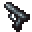

# Walther P99

<small>[Tensura: Reincarnated](../../index.md) &rsaquo; [Items](../index.md) &rsaquo; [Weapons](index.md)</small>

| | |
|---|---|
| **ID** | `tensura:walther_p99` |
| **Category** | Weapons |
| **Durability** | 500 |

## Description

Mode: Magic Bullet.

Mode: Physical Bullet.

Shift Right-click to change modes.

## Tags

`minecraft:enchantable/crossbow`, `tensura:dummy_remove_on_leaving_hand`, `tensura:ranged_enchantable`
