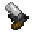

# Web Gun

<small>[Tensura: Reincarnated](../../index.md) &rsaquo; [Items](../index.md) &rsaquo; [Weapons](index.md)</small>

| | |
|---|---|
| **ID** | `tensura:web_gun` |
| **Category** | Weapons |
| **Durability** | 340 |
| **Gear EP** | 6,000 - None |

## Description

Projectile:

## What it does

It is made at the Smithing Bench.

## Obtaining

### Recipes

**Smithing Bench** &rarr;  [Web Gun](web-gun.md)

Ingredients:  [Iron Ingot](https://minecraft.wiki/w/Iron_Ingot) x2,  [Redstone](https://minecraft.wiki/w/Redstone)

Requires schematic:  [Web Gun Schematic](../schematics/web-gun-schematic.md)

## Tags

`tensura:ranged_enchantable`
