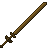

# Wooden Great Sword

<small>[Tensura: Reincarnated](../../index.md) &rsaquo; [Items](../index.md) &rsaquo; [Weapons](index.md)</small>

| | |
|---|---|
| **ID** | `tensura:wooden_great_sword` |
| **Category** | Weapons |
| **Attack damage** | 7 (0 one-handed) |
| **Attack speed** | 0.8 (0 one-handed) |
| **Reach** | +2 blocks |
| **Sweep damage** | +50% |
| **Tier** | Wood |
| **Durability** | 59 |

## What it does

A great sword you can hold in one or both hands. Two-handed it deals **7** attack damage at **0.8** attack speed; one-handed **0** damage at **0** speed. It also has +2 blocks of reach and 50% sweeping damage. Durability: **59**. It is made at the Smithing Bench.

## Obtaining

### Recipes

**Smithing Bench** &rarr;  [Wooden Great Sword](wooden-great-sword.md)

Ingredients:  `#minecraft:planks` x4,  [Stick](https://minecraft.wiki/w/Stick)

Requires schematic:  [Great Sword Schematic](../schematics/great-sword-schematic.md)

## Tags

`tensura:great_swords`
