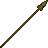
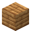

# Wooden Spear

<small>[Tensura: Reincarnated](../../index.md) &rsaquo; [Items](../index.md) &rsaquo; [Weapons](index.md)</small>

| | |
|---|---|
| **ID** | `tensura:wooden_spear` |
| **Category** | Weapons |

## Obtaining

### Recipes

**Smithing Bench** &rarr;  [Wooden Spear](wooden-spear.md)

Ingredients:  `#minecraft:planks`,  [Stick](https://minecraft.wiki/w/Stick) x3

Requires schematic:  [Spear Schematic](../schematics/spear-schematic.md)

## Tags

`mysticism:projectile`, `tensura:spears`
