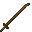

# Wooden Tachi

<small>[Tensura: Reincarnated](../../index.md) &rsaquo; [Items](../index.md) &rsaquo; [Weapons](index.md)</small>

| | |
|---|---|
| **ID** | `tensura:wooden_tachi` |
| **Category** | Weapons |

## Obtaining

### Recipes

**Smithing Bench** &rarr;  [Wooden Tachi](wooden-tachi.md)

Ingredients:  `#minecraft:planks` x3,  [Stick](https://minecraft.wiki/w/Stick)

Requires schematic:  [Long Sword Schematic](../schematics/long-sword-schematic.md),  [Japanese Sword Schematic](../schematics/japanese-sword-schematic.md)

## Tags

`tensura:tachis`
