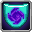

# Akash

<small>[Tensura: Reincarnated](../index.md) &rsaquo; [Mobs](index.md) &rsaquo; Bosses</small>

| | |
|---|---|
| **ID** | `tensura:akash` |
| **Type** | Boss |
| **Health** | 300 |
| **Attack damage** | 20 |
| **Armor** | 5 |
| **Speed** | 0.25 |
| **Follow range** | 64 |
| **Knockback resistance** | 1 |
| **Magicule (EP)** | 120,000 - 150,000 |
| **Spiritual health** | 2,000 |
| **Hitbox** | 0.8 x 1.7 blocks |
| **Spawn egg** |  [Akash Spawn Egg](../items/spawn-eggs/akash-spawn-egg.md) |

## What it does

A greater spirit of space. When a [Winged Cat](winged-cat.md) spawns naturally in the Ancient Forest, there's a 1 in 400 chance Akash appears in its place. It can also be summoned with [Summon Greater Elemental](../abilities/summoning-magic/summon-greater-elemental.md), and Hinata can call it.

A boss with **300** health, **20** attack damage and **120,000-150,000** magicule. It has 4 skills you can take from it with Predator-type skills. Drops [Elemental Essence](../items/materials/elemental-essence.md) and [Elemental Shard (Space)](../items/materials/space-elemental-shard.md).

## Abilities

This mob has these skills (and they can be obtained from it, for example with Predator-type skills):

-  [Space Transform](../abilities/intrinsic-skills/space-transform.md)
-  [Spatial Manipulation](../abilities/extra-skills/spatial-manipulation.md)
-  [Teleport](../abilities/spiritual-magic/teleport.md)
-  [Spatial Attack Nullification](../abilities/resistance-skills/spatial-attack-nullification.md)

## Drops

| Item | Count | Chance | Notes |
|---|---|---|---|
|  [Elemental Essence](../items/materials/elemental-essence.md) | 1 | 100% |  |
|  [Elemental Shard (Space)](../items/materials/space-elemental-shard.md) | 1-3 | 100% |  |

## Tags

`c:bosses`, `c:capturing_not_supported`, `elitetensura:extra_cash_drops`, `minecraft:can_breathe_under_water`, `minecraft:fall_damage_immune`, `tensura:boss_for_hero`, `tensura:can_be_named`, `tensura:drop_crystal`, `tensura:full_gravity_control`, `tensura:nameable`, `tensura:neutral_monster`, `tensura:no_fear`, `tensura:no_severance`, `tensura:spiritual`
