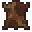

# Barghest

<small>[Tensura: Reincarnated](../index.md) &rsaquo; [Mobs](index.md) &rsaquo; Monster</small>

| | |
|---|---|
| **ID** | `tensura:barghest` |
| **Type** | Monster |
| **Health** | 40 |
| **Attack damage** | 6 |
| **Speed** | 0.2 |
| **Knockback resistance** | 0.2 |
| **Magicule (EP)** | 2,000 - 4,000 |
| **Spiritual health** | 80 |
| **Hitbox** | 0.9 x 1.4 blocks |
| **Spawn egg** |  [Barghest Spawn Egg](../items/spawn-eggs/barghest-spawn-egg.md) |

## What it does

A hostile mob with **40** health, **6** attack damage and **2,000-4,000** magicule. Spawns naturally in Barghest Spawn. Drops [Monster Leather (C)](../items/miscellaneous/monster-leather-c.md).

## Spawning

| Biomes | Weight | Group size |
|---|---|---|
| Is Plains, Ancient Forest, Miasmic Plains | 80 | 2-4 |

## Drops

| Item | Count | Chance | Notes |
|---|---|---|---|
|  [Monster Leather (C)](../items/miscellaneous/monster-leather-c.md) | 1-3 | 100% | More with Looting |

## Tags

`elitetensura:extra_cash_drops`, `elitetensura:nation_spawn/tier2`, `tensura:can_be_named`, `tensura:drop_crystal`, `tensura:guard_prey`, `tensura:hostile_monster`, `tensura:hot_source`, `tensura:monster`, `tensura:nameable`, `tensura:no_charisma`
