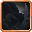
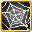

# Black Spider

<small>[Tensura: Reincarnated](../index.md) &rsaquo; [Mobs](index.md) &rsaquo; Monster</small>

| | |
|---|---|
| **ID** | `tensura:black_spider` |
| **Type** | Monster |
| **Health** | 65 |
| **Attack damage** | 10 |
| **Armor** | 6 |
| **Speed** | 0.25 |
| **Knockback resistance** | 0.6 |
| **Magicule (EP)** | 5,000 - 6,000 |
| **Aura** | 1,000 - 1,500 |
| **Spiritual health** | 200 |
| **Hitbox** | 3 x 2.5 blocks |
| **Spawn egg** |  [Black Spider Spawn Egg](../items/spawn-eggs/black-spider-spawn-egg.md) |

## What it does

A hostile mob with **65** health, **10** attack damage and **5,000-6,000** magicule. Spawns naturally in Black Spider Spawn. It has 2 skills you can take from it with Predator-type skills. Drops [Sticky Thread](../items/miscellaneous/sticky-thread.md), [Steel Thread](../items/miscellaneous/steel-thread.md), [Spider Fang](../items/materials/spider-fang.md) and [Spider Eye](https://minecraft.wiki/w/Spider_Eye).

## Abilities

This mob has these skills (and they can be obtained from it, for example with Predator-type skills):

-  [Exoskeleton](../../tensura-mysticism/abilities/intrinsic-skills/exoskeleton.md)
-  [Stick Steel Thread](../abilities/extra-skills/sticky-steel-thread.md)

## Spawning

| Biomes | Weight | Group size |
|---|---|---|
| Is Cave, Dripstone Caves, Lush Caves | 80 | 1-2 |

## Drops

| Item | Count | Chance | Notes |
|---|---|---|---|
|  [Sticky Thread](../items/miscellaneous/sticky-thread.md) | 10-20 | 100% | More with Looting |
|  [Steel Thread](../items/miscellaneous/steel-thread.md) | 10-20 | 100% | More with Looting |
|  [Spider Fang](../items/materials/spider-fang.md) | 1-3 | 100% |  |
|  [Spider Eye](https://minecraft.wiki/w/Spider_Eye) | 6-8 | 100% |  |

## Tags

`elitetensura:extra_cash_drops`, `elitetensura:nation_spawn/tier2`, `minecraft:arthropod`, `tensura:can_be_named`, `tensura:drop_crystal`, `tensura:hostile_monster`, `tensura:monster`, `tensura:nameable`, `tensura:no_charisma`, `tensura:web_walkable_mobs`
