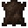

# Blade Tiger

<small>[Tensura: Reincarnated](../index.md) &rsaquo; [Mobs](index.md) &rsaquo; Monster</small>

| | |
|---|---|
| **ID** | `tensura:blade_tiger` |
| **Type** | Monster |
| **Health** | 100 |
| **Attack damage** | 20 |
| **Armor** | 10 |
| **Speed** | 0.2 |
| **Knockback resistance** | 0.6 |
| **Magicule (EP)** | 8,000 - 11,000 |
| **Aura** | 1,000 - 2,000 |
| **Spiritual health** | 300 |
| **Hitbox** | 1.5 x 2.6 blocks |
| **Spawn egg** |  [Blade Tiger Spawn Egg](../items/spawn-eggs/blade-tiger-spawn-egg.md) |

## What it does

A hostile mob with **100** health, **20** attack damage and **8,000-11,000** magicule. Spawns naturally in Blade Tiger Spawn. It has 1 skill you can take from it with Predator-type skills. Drops [Monster Leather (A)](../items/miscellaneous/monster-leather-a.md), [Raw Blade Tiger Meat](../items/miscellaneous/raw-blade-tiger-meat.md) and [Blade Tiger Tail](../items/miscellaneous/blade-tiger-tail.md).

## Abilities

This mob has these skills (and they can be obtained from it, for example with Predator-type skills):

-  [Voice Cannon](../abilities/common-skills/voice-cannon.md)

## Spawning

| Biomes | Weight | Group size |
|---|---|---|
| Is Forest, Ancient Forest | 60 | 1-1 |

## Drops

| Item | Count | Chance | Notes |
|---|---|---|---|
|  [Monster Leather (A)](../items/miscellaneous/monster-leather-a.md) | 0-3 | 100% | More with Looting |
|  [Raw Blade Tiger Meat](../items/miscellaneous/raw-blade-tiger-meat.md) | 1-3 | 100% | More with Looting |
|  [Blade Tiger Tail](../items/miscellaneous/blade-tiger-tail.md) | 1 | 100% |  |

## Tags

`elitetensura:extra_cash_drops`, `elitetensura:nation_spawn/tier3`, `tensura:can_be_named`, `tensura:drop_crystal`, `tensura:hostile_monster`, `tensura:monster`, `tensura:nameable`, `tensura:no_charisma`
