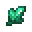

# Feathered Serpent

<small>[Tensura: Reincarnated](../index.md) &rsaquo; [Mobs](index.md) &rsaquo; Other</small>

| | |
|---|---|
| **ID** | `tensura:feathered_serpent` |
| **Magicule (EP)** | 6,000 - 9,000 |
| **Spiritual health** | 500 |
| **Spawn egg** |  [Feathered Serpent Spawn Egg](../items/spawn-eggs/feathered-serpent-spawn-egg.md) |

## Abilities

This mob has these skills (and they can be obtained from it, for example with Predator-type skills):

-  [Wind Manipulation](../abilities/extra-skills/wind-manipulation.md)
-  [Wind Transform](../abilities/intrinsic-skills/wind-transform.md)
-  [Wind Attack Resistance](../abilities/resistance-skills/wind-attack-resistance.md)

## Spawning

| Biomes | Weight | Group size |
|---|---|---|
| `#tensura:feathered_serpent_spawn` | 5 | 1-1 |

## Drops

| Item | Count | Chance | Notes |
|---|---|---|---|
|  [Elemental Shard (Wind)](../items/materials/wind-elemental-shard.md) | 1 | 25% |  |
|  [Elemental Essence](../items/materials/elemental-essence.md) | 1 | 10% |  |

## Tags

`elitetensura:extra_cash_drops`, `elitetensura:nation_spawn/tier2`, `minecraft:can_breathe_under_water`, `tensura:can_be_named`, `tensura:drop_crystal`, `tensura:nameable`, `tensura:neutral_monster`, `tensura:spiritual`
