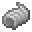
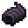

# Hell Caterpillar

<small>[Tensura: Reincarnated](../index.md) &rsaquo; [Mobs](index.md) &rsaquo; Monster</small>

| | |
|---|---|
| **ID** | `tensura:hell_caterpillar` |
| **Type** | Monster |
| **Health** | 8 |
| **Attack damage** | 5 |
| **Speed** | 0.15 |
| **Knockback resistance** | 0.2 |
| **Magicule (EP)** | 2,000 - 2,999 |
| **Aura** | 1,000 - 2,000 |
| **Spiritual health** | 40 |
| **Hitbox** | 0.9 x 0.9 blocks |
| **Spawn egg** |  [Hell Caterpillar Spawn Egg](../items/spawn-eggs/hell-caterpillar-spawn-egg.md) |

## What it does

A hostile mob with **8** health, **5** attack damage and **2,000-2,999** magicule. Spawns naturally in Hell Caterpillar Spawn. Drops [Hell-Moth Silk](../items/miscellaneous/hell-moth-silk.md) and [Gehenna-Moth Silk](../items/miscellaneous/gehenna-moth-silk.md).

## Spawning

| Biomes | Weight | Group size |
|---|---|---|
| Cherry Grove | 20 | 1-3 |

## Drops

| Item | Count | Chance | Notes |
|---|---|---|---|
|  [Hell-Moth Silk](../items/miscellaneous/hell-moth-silk.md) | 6-12 | 25% | More with Looting, entity properties |
|  [Hell-Moth Silk](../items/miscellaneous/hell-moth-silk.md) | 1-3 | 25% | More with Looting, entity properties |
|  [Gehenna-Moth Silk](../items/miscellaneous/gehenna-moth-silk.md) | 1-3 | 25% | More with Looting, entity properties |
|  [Gehenna-Moth Silk](../items/miscellaneous/gehenna-moth-silk.md) | 6-12 | 25% | More with Looting |

## Tags

`elitetensura:extra_cash_drops`, `elitetensura:nation_spawn/tier1`, `minecraft:arthropod`, `tensura:can_be_named`, `tensura:drop_crystal`, `tensura:monster`, `tensura:nameable`, `tensura:neutral_monster`
