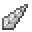

# Horned Rabbit

<small>[Tensura: Reincarnated](../index.md) &rsaquo; [Mobs](index.md) &rsaquo; Monster</small>

| | |
|---|---|
| **ID** | `tensura:horned_rabbit` |
| **Type** | Monster |
| **Health** | 20 |
| **Attack damage** | 10 |
| **Speed** | 0.3 |
| **Magicule (EP)** | 2,000 - 3,000 |
| **Aura** | 1,000 - 3,000 |
| **Spiritual health** | 50 |
| **Hitbox** | 0.5 x 0.8 blocks |
| **Spawn egg** |  [Horned Rabbit Spawn Egg](../items/spawn-eggs/horned-rabbit-spawn-egg.md) |

## What it does

A hostile mob with **20** health, **10** attack damage and **2,000-3,000** magicule. Spawns naturally in Horned Rabbit Spawn. Drops [Monster Leather (C)](../items/miscellaneous/monster-leather-c.md), [Beast Horn](../items/materials/beast-horn.md) and [Rabbit Foot](https://minecraft.wiki/w/Rabbit_Foot).

## Spawning

| Biomes | Weight | Group size |
|---|---|---|
| Is Taiga, Cherry Grove | 20 | 1-2 |

## Drops

| Item | Count | Chance | Notes |
|---|---|---|---|
|  [Monster Leather (C)](../items/miscellaneous/monster-leather-c.md) | 1-3 | 100% | More with Looting |
|  [Beast Horn](../items/materials/beast-horn.md) | 0-1 | 100% |  |
|  [Rabbit Foot](https://minecraft.wiki/w/Rabbit_Foot) | 0-1 | 100% |  |

## Tags

`elitetensura:extra_cash_drops`, `elitetensura:nation_spawn/tier1`, `minecraft:powder_snow_walkable_mobs`, `tensura:can_be_named`, `tensura:drop_crystal`, `tensura:monster`, `tensura:nameable`, `tensura:neutral_monster`
