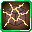
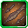
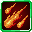
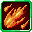
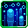

# Lesser Daemon

<small>[Tensura: Reincarnated](../index.md) &rsaquo; [Mobs](index.md) &rsaquo; Monster</small>

| | |
|---|---|
| **ID** | `tensura:lesser_daemon` |
| **Type** | Monster |
| **Health** | 40 |
| **Attack damage** | 10 |
| **Armor** | 10 |
| **Speed** | 0.3 |
| **Knockback resistance** | 0.2 |
| **Magicule (EP)** | 7,500 - 8,000 |
| **Aura** | 500 - 1,000 |
| **Spiritual health** | 200 |
| **Hitbox** | 1.2 x 4.8 blocks |
| **Spawn egg** |  [Lesser Daemon Spawn Egg](../items/spawn-eggs/lesser-daemon-spawn-egg.md) |

## What it does

A hostile mob with **40** health, **10** attack damage and **7,500-8,000** magicule. Spawns naturally in Lesser Daemon Spawn. It has 11 skills you can take from it with Predator-type skills. Drops [Daemon Essence](../items/materials/daemon-essence.md).

## Abilities

This mob has these skills (and they can be obtained from it, for example with Predator-type skills):

-  [Magic Sense](../abilities/extra-skills/magic-sense.md)
-  [Possession](../abilities/intrinsic-skills/possession.md)
-  [Magic Resistance](../abilities/resistance-skills/magic-resistance.md)
-  [Earth Lock](../abilities/aspectual-magic/earth-lock.md)
-  [Stone Shot](../abilities/aspectual-magic/stone-shot.md)
-  [Fire](../abilities/aspectual-magic/fire-aspectual.md)
-  [Fire Ball](../abilities/aspectual-magic/fire-ball.md)
-  [Water](../abilities/aspectual-magic/water-aspectual.md)
-  [Water Cutter](../abilities/aspectual-magic/water-cutter-aspectual.md)
-  [Wind Gust](../abilities/aspectual-magic/wind-gust.md)
-  [Wind Cutter](../abilities/aspectual-magic/wind-cutter.md)

## Spawning

| Biomes | Weight | Group size |
|---|---|---|
| Underworld Barrens, Underworld Red Sands, Underworld Sands, Underworld Spikes | 60 | 1-1 |

## Drops

| Item | Count | Chance | Notes |
|---|---|---|---|
|  [Daemon Essence](../items/materials/daemon-essence.md) | 1 | 1.0% |  |

## Tags

`elitetensura:extra_cash_drops`, `elitetensura:nation_spawn/tier3`, `minecraft:can_breathe_under_water`, `minecraft:fall_damage_immune`, `tensura:can_be_named`, `tensura:daemons`, `tensura:drop_crystal`, `tensura:full_gravity_control`, `tensura:hostile_monster`, `tensura:monster`, `tensura:nameable`, `tensura:no_charisma`, `tensura:spiritual`
