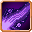
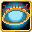
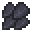
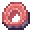

# Tempest Serpent

<small>[Tensura: Reincarnated](../index.md) &rsaquo; [Mobs](index.md) &rsaquo; Monster</small>

| | |
|---|---|
| **ID** | `tensura:tempest_serpent` |
| **Type** | Monster |
| **Health** | 70 |
| **Attack damage** | 20 |
| **Armor** | 10 |
| **Speed** | 0.3 |
| **Knockback resistance** | 0.25 |
| **Magicule (EP)** | 8,000 - 8,500 |
| **Aura** | 1,000 - 1,500 |
| **Spiritual health** | 160 |
| **Hitbox** | 1.1 x 1 blocks |
| **Spawn egg** |  [Tempest Serpent Spawn Egg](../items/spawn-eggs/tempest-serpent-spawn-egg.md) |

## What it does

A hostile mob with **70** health, **20** attack damage and **8,000-8,500** magicule. Spawns naturally in Tempest Serpent Spawn. It has 2 skills you can take from it with Predator-type skills. Drops [Serpent Scale](../items/materials/serpent-scale.md) and [Raw Serpent Meat](../items/miscellaneous/raw-serpent-meat.md).

## Abilities

This mob has these skills (and they can be obtained from it, for example with Predator-type skills):

-  [Poisonous Breath](../abilities/intrinsic-skills/poisonous-breath.md)
-  [Sense Heat Source](../abilities/extra-skills/sense-heat-source.md)

## Spawning

| Biomes | Weight | Group size |
|---|---|---|
| Is Cave, Dripstone Caves, Lush Caves, Desert of Death | 40 | 1-1 |

## Drops

| Item | Count | Chance | Notes |
|---|---|---|---|
|  [Serpent Scale](../items/materials/serpent-scale.md) | 1-6 | 100% | More with Looting |
|  [Raw Serpent Meat](../items/miscellaneous/raw-serpent-meat.md) | 1-4 | 100% | More with Looting |

## Tags

`elitetensura:extra_cash_drops`, `elitetensura:nation_spawn/tier3`, `minecraft:can_breathe_under_water`, `minecraft:fall_damage_immune`, `tensura:can_be_named`, `tensura:cold_blooded`, `tensura:drop_crystal`, `tensura:hostile_monster`, `tensura:monster`, `tensura:nameable`, `tensura:no_charisma`
